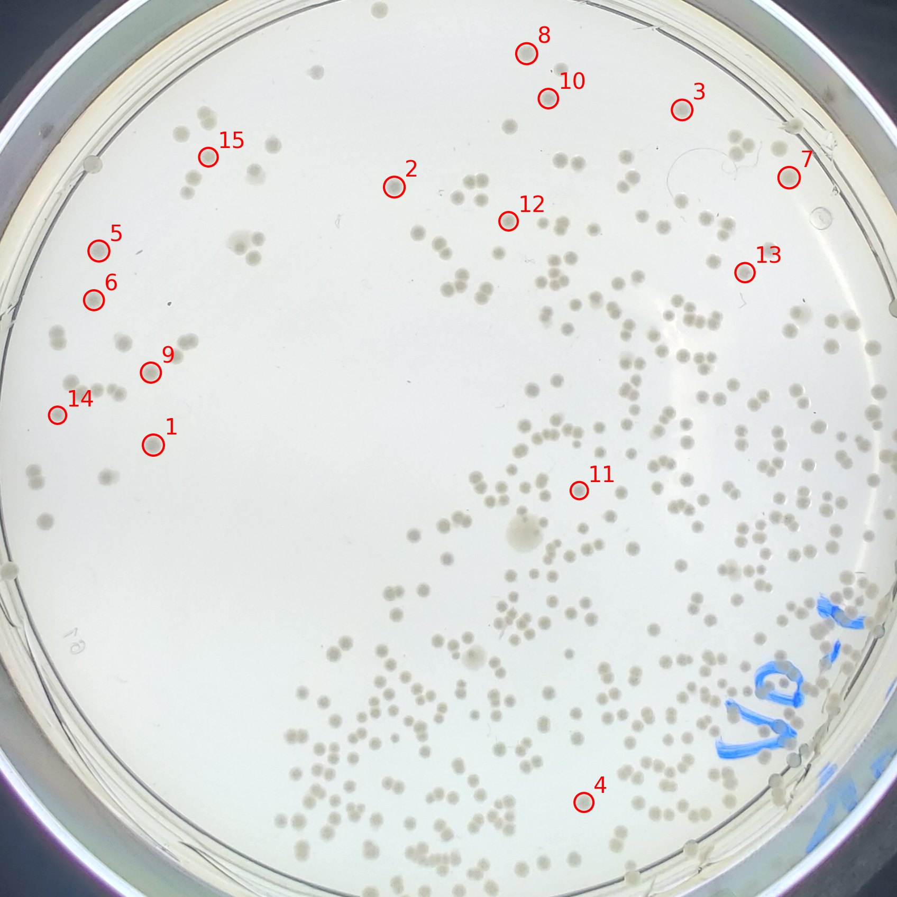

# Colony Morphology
Python3 library to analyse culture characteristics of a bacterial colony on an agar plate.

Apply a mask based on the petri dish radius and use the watershed algorithm to find the cell's. Finally, annotate the best colonies based on cell's metrics: area, diameter, eccentricity, min distance from near neighbor's.

<p align="center">
  
</p>

| ID | Label | Cell Quality | Area | Diameter | Eccentricity | Compactness | Solidity | Collision Distance | Centroid (x) | Centroid (y) |
| -- | ----- | ------------ | ---- | -------- | ------------ | ----------- | -------- | ------------------ | ------------ | ------------ |
| 1  | 663   | 0.83         | 722  | 30       | 0.38         | 0.85        | 0.95     | 68                 | 841.61       | 289.45       |
| 2  | 405   | 0.79         | 659  | 29       | 0.43         | 0.86        | 0.95     | 64                 | 567.26       | 176.72       |
| 3  | 811   | 0.79         | 738  | 31       | 0.28         | 0.88        | 0.96     | 54                 | 987.14       | 85.16        |
| 4  | 26    | 0.79         | 657  | 29       | 0.31         | 0.87        | 0.95     | 60                 | 473.98       | 1289.24      |
| 5  | 318   | 0.78         | 724  | 30       | 0.41         | 0.84        | 0.96     | 56                 | 1517.73      | 186.61       |
| 6  | 1566  | 0.76         | 558  | 27       | 0.35         | 0.84        | 0.92     | 65                 | 101.51       | 1103.42      |
| 7  | 14    | 0.72         | 736  | 31       | 0.44         | 0.81        | 0.94     | 42                 | 335.8        | 995.64       |
| 8  | 182   | 0.71         | 763  | 31       | 0.29         | 0.87        | 0.95     | 31                 | 704.66       | 1491.42      |
| 9  | 554   | 0.70         | 652  | 29       | 0.33         | 0.82        | 0.94     | 41                 | 417.92       | 284.94       |
| 10 | 261   | 0.67         | 518  | 26       | 0.42         | 0.85        | 0.95     | 39                 | 784.91       | 960.58       |

## Dependencies
Install dependencies:
``` sh
$ pip install -r requirements
```

## Build
Build library:
``` sh
$ pip install .
```

## Run

Try playing with different [parameters](./demo/demo.py#L46-L80), you can also enable different [saving and plot options](./demo/demo.py#L87-L92):

``` sh
# realsense camera
$ python3 demo/demo.py --image_path=dataset/intel_rs_d415_1.png --dish_diameter=882 --dish_offset=67

$ python3 demo/demo.py --image_path=dataset/intel_rs_d415_2.png --dish_diameter=882 --dish_offset=67

# oneplus camera
# Note: modify closing/opening kernel respectively to (9,9) and (3,3)
$ python3 demo/demo.py --image_path=dataset/oneplus_hd1900_1.jpg --dish_diameter=2100 --dish_offset=200 --cell_min_diameter=12

```

## Results
Check the [result](./result) folder for annotated and cropped images from the demo.

