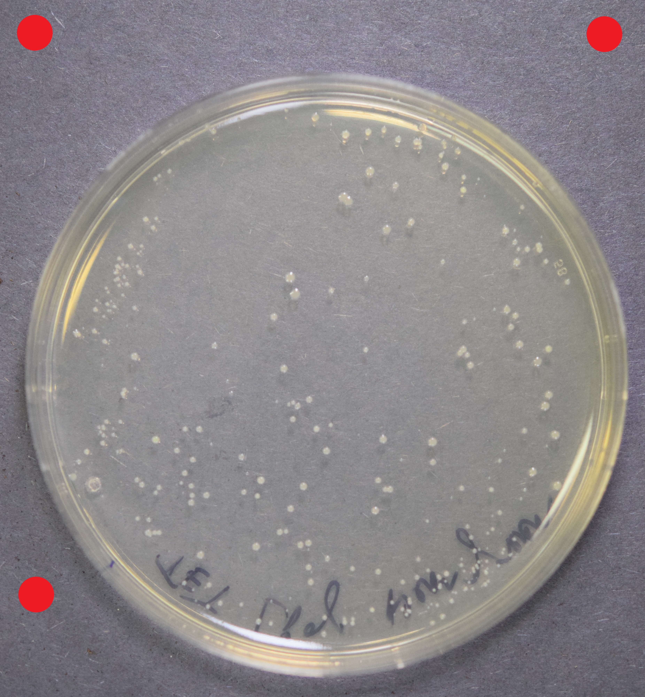
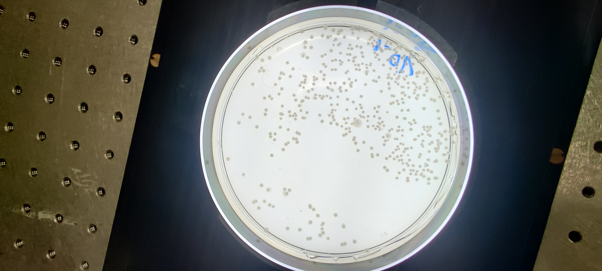
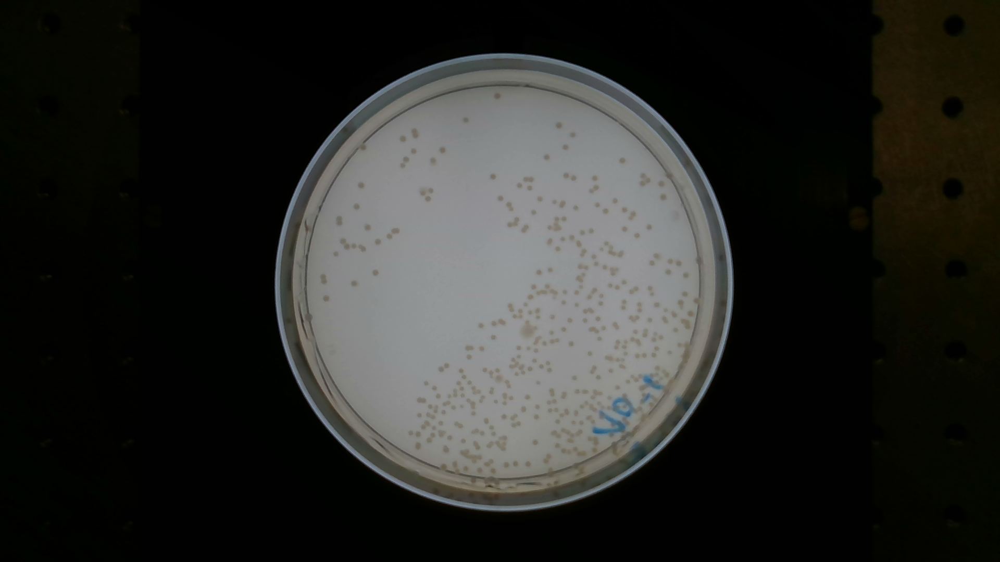
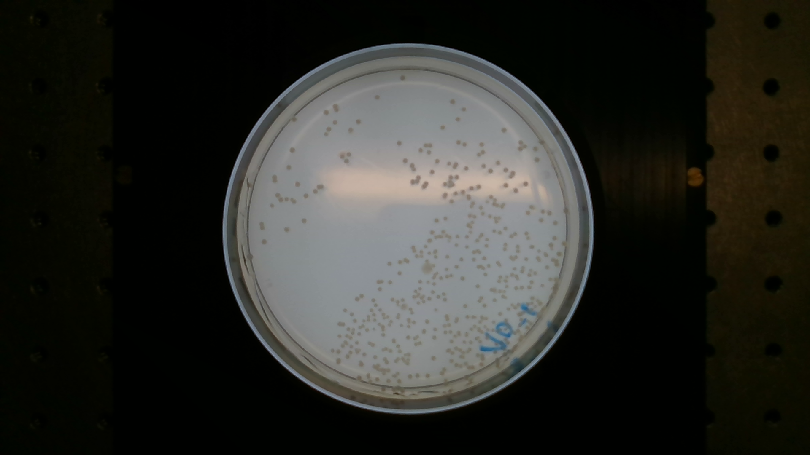

# Image Dataset

List of dataset images.

| Image                                                   | Resource             | Brand             | Model          | Size (width, height) | Description                     |
|---------------------------------------------------------|----------------------|-------------------|----------------|----------------------|---------------------------------|
|     | nikon_d5300_1.jpg    | Nikon Corporation | D5300          | 3704x4000            | No backlight, grey background.  |
|  | oneplus_hd1900_1.jpg | OnePlus           | HD1900         | 4608x2074            | White backlight                 |
|   | intel_rs_d415_1.png  | Intel             | RealSense D415 | 1920x1080            | White backhlight, without glare |
|   | intel_rs_d415_2.png  | Intel             | RealSense D415 | 1920x1080            | White backhlight, with glare    |

*You can right-click the image to obtain more image properties.*
